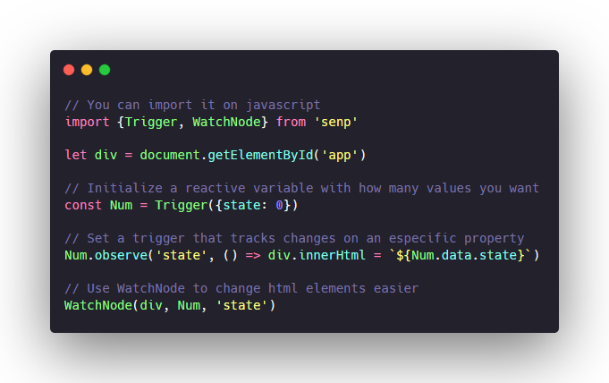

<h1 align="center">Sling</h1>

Sling is a very simple reactive library based on triggers. It was inspired by [this article](https://www.monterail.com/blog/2016/how-to-build-a-reactive-engine-in-javascript-part-1-observable-objects) and is heavily focused on it.

<p align="center">
     
    <br>
     &nbsp; 
     
</p>

### ⚙️ How to use?
One of the most simple yet useful example is changing the value of an element based on click. To do this, you need an html template like this:

```html
    <script src="https://cdn.jsdelivr.net/gh/hipesoft/senp/src/index.js"></script>

    <div id="app">0</div>
    <button onclick="Handleclick()">Click me!</button>
```
And a simple script, that tells the div content to change when the value changes:

<p align="center">

</p>

### ♻️ Contributing
1. Fork this repository
2. Create a new branch with your feature name: `git checkout -b my-feature`
3. Work and commit your code: `git commit -m "my-feature or fix"`
4. Push the code to the forked repo: `git push forked master`
5. Compare and pull-request (explain what you are introducing and its consequences)

-------

Made with :heart: and javascript